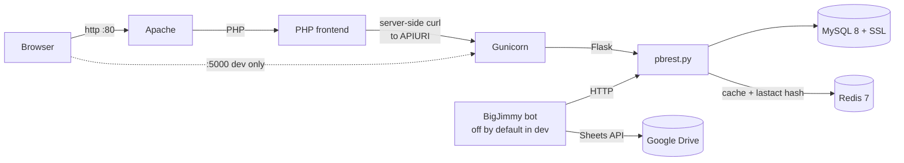

# Puzzleboss — Local Docker setup

This is the standard local-development environment for Puzzleboss. It runs the full stack (Apache + PHP frontend, Gunicorn + Flask API, MySQL with SSL) in two containers, with code mounted from the host for live reload.

For production deployment, see [puzzleboss2-infra](https://github.com/bigjimmy/puzzleboss2-infra).

## Prerequisites

- Docker and Docker Compose
- Free local ports `80`, `3306`, and `5000` (see [Port conflicts](#port-conflicts) below if not)

## Quick start

```bash
docker-compose up --build
```

First build takes 2-3 minutes. The stack is ready when you see Apache and Gunicorn access logs streaming.

Then open <http://localhost?assumedid=testuser>.

Other endpoints:

| URL | Purpose |
|---|---|
| <http://localhost?assumedid=testuser> | Main web UI |
| <http://localhost:5000/apidocs> | Swagger / OpenAPI explorer |
| <http://localhost:5000/metrics> | Prometheus metrics |
| <http://localhost/admin.php?assumedid=testuser> | Admin / config editor |

### The test user

The schema seed creates one user, `testuser`, with full admin privileges (`puzztech` + `puzzleboss`). The PHP frontend is in test mode, so `?assumedid=testuser` substitutes for SSO. Use this for all local testing — you don't need to set up auth.

## What the stack looks like



PHP mediates every API call — the browser never talks to Flask directly in the normal flow. In this dev stack, port `5000` is also published so you can hit Swagger and `/metrics` directly without going through PHP; in production that port stays inside the container.

`app` container = Apache + Gunicorn + (optionally) BigJimmy under supervisord. `mysql` container = MySQL with auto-generated TLS certs. `redis` container = Redis 7 (`redis:7-alpine`), the `/all` response cache and the write-through `lastact` hash; the dev entrypoint seeds `REDIS_ENABLED=true`/`REDIS_HOST=redis`/`REDIS_PORT=6379`. One short-lived `ssl-setup` container copies certs to a shared volume on first boot.

## Working with the running stack

```bash
# Background mode
docker-compose up -d --build

# Container status
docker-compose ps

# Logs
docker-compose logs -f app          # Apache + Gunicorn + (maybe) bigjimmy
docker-compose logs -f mysql
docker exec puzzleboss-app tail -f /var/log/gunicorn/error.log

# Open a MySQL prompt
docker exec -it puzzleboss-mysql mysql -u puzzleboss -ppuzzleboss123 puzzleboss

# Reload Python after editing a .py file
docker-compose restart app

# Stop services (keeps DB data)
docker-compose down

# Stop and wipe DB data + certs (fresh start)
docker-compose down -v
```

PHP, Python, scripts, swag, migrations, and tests are all volume-mounted, so most code changes are live without a rebuild. Only Dockerfile / supervisord / Apache-config changes need `--build`.

## Try it out

After the stack is up:

1. Open <http://localhost?assumedid=testuser>. You'll see an empty main UI.
2. Click **pbtools** in the nav. Add a round, then add a puzzle to it.
3. Return to the main page — the round and puzzle now appear.
4. Visit <http://localhost:5000/apidocs>, expand `GET /solvers`, click **Try it out** → **Execute**. You should see `testuser` in the response.

That's the whole golden path. From here, see [docs/OPERATIONS.md](../docs/OPERATIONS.md) for how the system is actually used during a hunt.

## Configuration

**Default behavior:** the Docker image ships with a baked-in `puzzleboss.yaml` tuned for the compose network (MySQL host `mysql`, test credentials, SSL on, Google + Discord disabled). No config required to start.

**To override:** create `puzzleboss.yaml` in the project root from `puzzleboss-SAMPLE.yaml`, then uncomment the volume mount in `docker-compose.yml`:

```yaml
- ./puzzleboss.yaml:/app/puzzleboss.yaml
```

Rebuild with `docker-compose up --build`.

Most runtime tuning happens in the database `config` table rather than the YAML — edit it via the admin UI (<http://localhost/admin.php?assumedid=testuser>) or directly via SQL.

## MySQL SSL

SSL is on by default. MySQL generates self-signed certs on first boot; the `ssl-setup` helper copies them to a shared volume the app container reads from.

If you see `TLS/SSL error: No such file or directory`, the certs volume is out of sync — wipe and rebuild:

```bash
docker-compose down -v
docker-compose up --build
```

To disable SSL for an offline test, edit `puzzleboss.yaml` and comment out the `SSL:` block, then restart the app container. (Don't ship this to production.)

For RDS connections (production setups outside this Docker stack), see [docs/SETUP.md](../docs/SETUP.md#rds).

## Optional features (off by default)

These integrations are wired up but disabled in the default Docker config. Turn them on when you need them.

All of these are configured through the **Configuration Management** page at <http://localhost/config.php?assumedid=testuser>. (Direct SQL works too, but the UI is the supported path and handles long values like the service account JSON cleanly.)

### Google Drive / Sheets (BigJimmy + sheet creation)

1. Create a Google Cloud service account with **Domain-Wide Delegation** enabled.
2. Authorize it in Google Workspace Admin (Security → API controls → Domain-wide delegation) for the scopes listed in [docs/SETUP.md](../docs/SETUP.md#google).
3. In the **Configuration Management** page: paste the JSON key into `SERVICE_ACCOUNT_JSON`, set `SERVICE_ACCOUNT_SUBJECT` to your Workspace admin email, and flip `SKIP_GOOGLE_API` to `false`.
4. Edit `docker/supervisord.conf` and set `autostart=true` for `[program:bigjimmybot]`.
5. Rebuild: `docker-compose up --build`.

### Discord (puzzcord)

In the **Configuration Management** page: set `SKIP_PUZZCORD=false` and fill in `PUZZCORD_HOST` / `PUZZCORD_PORT`. Requires a separately-running puzzcord daemon — see the puzzcord repo.

### LLM queries (Gemini)

Set `GEMINI_API_KEY` in the **Configuration Management** page. Endpoint becomes available at `POST /v1/query`.

### Wiki RAG

Set `WIKI_URL` and `WIKI_CHROMADB_PATH` in the **Configuration Management** page, then run `python scripts/wiki_indexer.py` (inside or outside the container).

## UI testing with Playwright

Playwright (Chromium only) is installed in the dev image. To run the bundled UI suite:

```bash
docker exec puzzleboss-app python /app/scripts/test_ui_comprehensive.py --list
docker exec puzzleboss-app python /app/scripts/test_ui_comprehensive.py --allow-destructive
```

Or run an ad-hoc script — see the example in [CLAUDE.md](../CLAUDE.md#testing).

## Port conflicts

| Conflict | Fix |
|---|---|
| Port 80 in use | `sudo lsof -i :80` to find culprit, or edit `docker-compose.yml` to remap (`"8080:80"`) |
| Port 3306 in use | You probably have a local MySQL. Stop it, or remap to `"3307:3306"` |
| Port 5000 in use | Common on macOS (AirPlay Receiver). Remap to `"5001:5000"` or disable AirPlay Receiver in System Settings |

## When something breaks

For Docker-specific issues (containers won't start, port conflicts, certificate weirdness), the fixes are in this file. For application-level issues (API returns errors, bot doesn't assign, sheets fail to create), see [docs/TROUBLESHOOTING.md](../docs/TROUBLESHOOTING.md).
