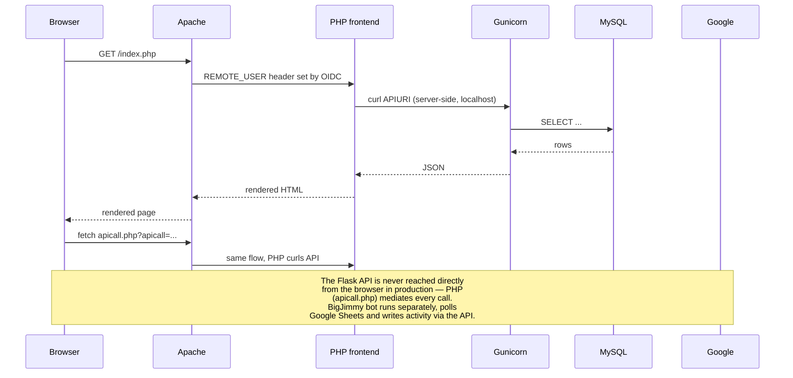

# Operations guide

For the person operating an already-running Puzzleboss instance — typically a new admin inheriting it from a previous one, or someone preparing for the upcoming hunt.

If you're standing it up for the first time, see [SETUP.md](SETUP.md) first. If it's broken right now, see [TROUBLESHOOTING.md](TROUBLESHOOTING.md).

## What you need to know first

- **Configuration lives in two places.** `puzzleboss.yaml` on disk holds bootstrap info (MySQL connection, API URL). The `config` table in MySQL holds everything else — team name, integration toggles, credentials, feature settings. The dynamic config refreshes every 30 seconds, so changes via the admin UI take effect within a minute without a restart.
- **The infra is in a separate repo.** Terraform, Grafana dashboards, ECS task definitions, deploy scripts, and the production-operations runbook live in [puzzleboss2-infra](https://github.com/bigjimmy/puzzleboss2-infra). This repo only contains application code.
- **Most issues during a hunt are integration issues, not application bugs.** Google quota, Discord rate limits, sheets-add-on failures. Watch [TROUBLESHOOTING.md](TROUBLESHOOTING.md).

## Request flow



## The components you operate

| Component | What it is | Where it lives | Notes |
|---|---|---|---|
| Web UI | Apache + PHP | inside the app container/server | What users see |
| API | Gunicorn + Flask | same container as Apache, bound to localhost:5000 | Not exposed externally in prod — PHP mediates browser → API via `apicall.php` |
| BigJimmy bot | Long-running Python process | `[program:bigjimmybot]` in supervisord | Enabled in production; disabled in the local dev stack (flip `autostart=true` in `docker/supervisord.conf`) |
| MySQL | The database | RDS in prod, container locally | Schema in [`scripts/puzzleboss.sql`](../scripts/puzzleboss.sql) |
| OIDC cache | Session storage for mod_auth_openidc | currently memcache, [Redis migration planned](../REDIS_MIGRATION.md) | Hard failure = login broken |
| Response cache | `/allcached` endpoint cache | same cache backend | Soft failure = falls through to DB |
| MediaWiki | Team wiki | separate container, shares auth | Optional |
| Observability stack | Loki + Grafana + Prometheus | separate EC2 in infra repo | See [observability](#observability) |

## The config table tour

The admin UI at `/admin.php` is the operator's main tool. Config keys are grouped by category — here are the ones you'll actually touch:

### Annual / per-hunt

| Key | Action |
|---|---|
| `TEAMNAME` | Display name |
| `HUNT_FOLDER_NAME` | Drive folder for this year's puzzle sheets |
| `BIGJIMMY_AUTOASSIGN` | Set `true` for hunts where you want auto-assignment |
| `hunt_domain` | Domain of the hunt website (for the bookmarklet) |
| `bookmarklet_js` | The bookmarklet itself — sometimes needs DOM tweaks if the hunt site has unusual markup |

### Integration toggles

| Key | Effect when `true` |
|---|---|
| `SKIP_GOOGLE_API` | Disables all Google Drive/Sheets — puzzles get no sheets |
| `SKIP_PUZZCORD` | Disables Discord |
| `ALLOW_USERNAME_OVERRIDE` | **Test mode** — `?assumedid=` works. Keep `false` in production. |
| `MEMCACHE_ENABLED` | Enables the `/allcached` cache |

### Bot tuning

| Key | What |
|---|---|
| `BIGJIMMY_PUZZLEPAUSETIME` | Seconds between sheet polls per puzzle (default 1) |
| `BIGJIMMY_THREADCOUNT` | Parallel sheet-polling threads (default 2) |
| `BIGJIMMY_GOOGLE_API_QPM` | Soft rate limit for Google API calls (default 55) |
| `BIGJIMMY_QUOTAFAIL_DELAY` / `BIGJIMMY_QUOTAFAIL_MAX_RETRIES` | Backoff on 429s |
| `BIGJIMMY_ABANDONED_TIMEOUT_MINUTES` | When to mark idle puzzles abandoned |

The full key list and descriptions live in [`www/config.php`](../www/config.php) (the `$keyDescriptions` array). That's the canonical reference — don't duplicate it.

## Common admin tasks

### Reset for a new hunt

```bash
python scripts/reset-hunt.py
```

Backs up the database to `scripts/backups/`, then wipes puzzles, rounds, and activity. **Solvers, privileges, and config are preserved**, so you don't need to re-onboard people.

Update for the new hunt:

```sql
UPDATE config SET val='Hunt 2027'  WHERE `key`='HUNT_FOLDER_NAME';
UPDATE config SET val='puzzlehunt.example.com' WHERE `key`='hunt_domain';
```

Test the bookmarklet against the new hunt site as soon as it's available.

### Add an admin

```sql
INSERT INTO privs (solver_id, priv) VALUES (
  (SELECT id FROM solver WHERE name='username'),
  'puzzleboss'
);
```

`puzzleboss` = admin; `puzztech` = config-editor.

### Bulk-import solvers

`POST /solvers` with a JSON body — see Swagger at `/apidocs` for the schema. For bigger imports, write a one-off script that hits the API.

### Run a data migration

When the application code introduces a schema or data change, it ships with a migration module under [`migrations/`](../migrations/) (see [`scripts/migrations/README.md`](../scripts/migrations/README.md) for the migration system).

```bash
# List available migrations
curl http://localhost:5000/migrate

# Run one
curl -X POST http://localhost:5000/migrate/<name>
```

Migrations are idempotent. Production-style: backup first (`mysqldump`), then run.

### Edit the Apps Script add-on

The add-on code lives in the `GOOGLE_APPS_SCRIPT_CODE` config value. Updating it only affects **new** puzzle sheets — to update existing ones, re-deploy via `POST /puzzles/activate_all`. Full details in [apps-script-deployment.md](apps-script-deployment.md).

## Observability

The production observability stack runs on a dedicated EC2 instance, configured via Terraform in the infra repo. The current host details (IP, SSH port, instance ID) live there — don't hardcode them here.

### What it gives you

| Tool | Purpose | Where |
|---|---|---|
| **Grafana** | Dashboards, alerting | served from the obs host |
| **Loki** | Centralized logs, queried via LogQL | ECS containers ship via FireLens + Fluent Bit |
| **Prometheus** | Metrics, scraped from `/metrics` | scrapes the app container |
| **Sift / oncall** | Optional, see Grafana docs | |

### Log labels to know

- `service=bigjimmy` — bot logs
- `service=puzzleboss` — Apache + Gunicorn logs (web + API)
- `service=mediawiki` — wiki container
- `service=puzzcord` — Discord daemon (if shipping there)

A typical query:

```logql
{service="puzzleboss"} |= "ERROR" | json
```

### Useful metrics

`/metrics` on the app container exposes:

- `bigjimmy_loop_time_seconds` — total time for last bot iteration
- `bigjimmy_quota_failures` — counter for Google 429s
- `bigjimmy_loop_puzzle_count` — puzzles processed last loop
- `cache_invalidations_total` — counter
- `puzzcord_members_active_anywhere` — gauge of currently-active solvers

The `botstats` table also holds historical metric data — `METRICS_METADATA` in the config table defines what's exposed.

## Deployment

Deployment is automated via GitHub Actions in this repo. Pushing to `master` builds new container images. The actual ECS rollout is triggered manually from the **Deploy** workflow (or via the deploy script in the infra repo). See [`.github/workflows/`](../.github/workflows/) for the workflow definitions.

For local/Docker development, no deployment — just `docker-compose up`.

## Backups

`scripts/reset-hunt.py` makes a timestamped backup before wiping. For ad-hoc backups:

```bash
mysqldump -u puzzleboss -p puzzleboss > backup_$(date +%Y%m%d_%H%M%S).sql
```

In production, RDS automated backups handle PITR. Snapshot before any large migration.

## Off-season

Between hunts:

- Keep the app + DB running (cheap) so signups still work and solvers can find old data.
- Or scale ECS service `desiredCount` to 0 (see infra repo) and bring back up a few weeks before the next hunt.
- Keep an eye on Google quota — DWD service-account keys don't expire but the JSON can be rotated. The `SERVICE_ACCOUNT_JSON` config value is what to update.

## What's normal during a hunt

- BigJimmy will occasionally hit 429s. As long as `bigjimmy_quota_failures` isn't climbing fast, it's fine — backoff handles it.
- Sheet add-on deploys can rate-limit when many puzzles are created at once. Retries happen automatically; failed sheets can be retried with `POST /puzzles/activate_all`.
- Some puzzles end up "Abandoned" when solvers idle on them. That's the `BIGJIMMY_ABANDONED_TIMEOUT_MINUTES` setting doing its job.
- The `/allcached` endpoint is the hot path during heavy traffic; cache hit rate over 90% with the default 15s TTL is normal.

## What's not normal

Anything in [TROUBLESHOOTING.md](TROUBLESHOOTING.md). Read it before the hunt starts.
