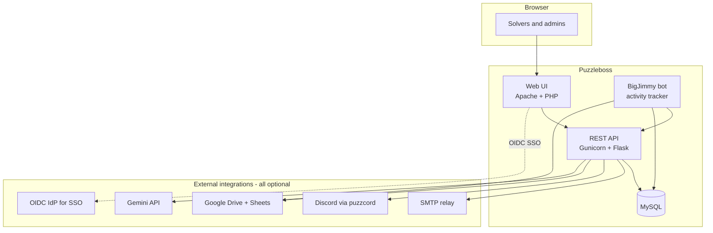

# Setting up Puzzleboss for your team

This guide is for a team adopting Puzzleboss for the first time. It walks through the choices you have to make and the integrations you have to set up to be ready for a hunt.

If you're inheriting an already-running system, you want [OPERATIONS.md](OPERATIONS.md) instead.

## What you're getting



Anything in *External* can be left off. Without Google you lose automatic puzzle-sheet creation and bot activity tracking. Without Discord you lose channel automation. Without SSO you need another way to set `REMOTE_USER` (or stay in test mode). Without Gemini you lose the natural-language query endpoint. The core puzzle-tracking functionality works with none of these.

## The setup path

1. [Decide where you're going to run it](#1-decide-where-youre-going-to-run-it)
2. [Stand up the application](#2-stand-up-the-application)
3. [Set the per-team config values](#3-set-the-per-team-config-values)
4. [Wire up Google (optional but recommended)](#4-google-integration)
5. [Wire up Discord (optional)](#5-discord-integration)
6. [Wire up email (optional, for account signup)](#6-email)
7. [Set up authentication for solvers](#7-authentication)
8. [Onboard solvers](#8-onboard-solvers)
9. [Pre-hunt readiness check](#9-pre-hunt-readiness-check)

## 1. Decide where you're going to run it

| Option | When to choose | Pointer |
|---|---|---|
| AWS ECS (Fargate) | Reasonable scale, infra-as-code, multi-component, what this team runs | [puzzleboss2-infra](https://github.com/bigjimmy/puzzleboss2-infra) |
| Single VM / EC2 | Small team, low overhead, OK with manual ops | [Standalone deployment](#standalone-deployment) below |
| Docker on a laptop | Local development, or running a tiny private hunt | [docker/README.md](../docker/README.md) |

Whatever you pick, the application code is the same — only the runtime environment differs.

### Standalone deployment

For a single-server install (EC2, VM, bare metal):

1. Clone this repo on the server.
2. Install prerequisites: Apache with PHP, Python ≥ 3.8, MySQL 8.x.
3. `pip install -r requirements.txt`
4. `mysql -u puzzleboss -p puzzleboss < scripts/puzzleboss.sql`
5. `cp puzzleboss-SAMPLE.yaml puzzleboss.yaml`, edit MySQL credentials.
6. Run the API: `gunicorn -c gunicorn_config.py wsgi:app`
7. Configure Apache to serve the PHP frontend and set up `REMOTE_USER` auth (see step 7). Bind Gunicorn to localhost (`127.0.0.1:5000`); PHP talks to it server-side via `APIURI` in `puzzleboss.yaml`. Reverse-proxy `/apidocs`, `/flasgger_static`, and `/apispec_1.json` to Gunicorn if you want Swagger accessible — see [`docker/prod/apache-prod.conf`](../docker/prod/apache-prod.conf) for the reference config.

## 2. Stand up the application

Once you've picked an environment and brought up the containers/services, sanity-check it:

- `GET /apidocs` returns the Swagger UI
- `GET /solvers` returns a non-empty list (the seed schema creates `testuser`)
- The web UI loads at the root URL

If any of that fails, go to [TROUBLESHOOTING.md](TROUBLESHOOTING.md) before continuing — there's no point configuring further if the basics aren't working.

## 3. Set the per-team config values

Most runtime configuration lives in the database `config` table, editable via the admin UI (`/admin.php`) or directly via SQL. Here are the ones every new team needs to set:

| Key | What it does | Example |
|---|---|---|
| `TEAMNAME` | Display name shown in UI and signup emails | `Mystik Spiral` |
| `HUNT_FOLDER_NAME` | Google Drive folder where this hunt's puzzle sheets go | `Hunt 2027` |
| `DOMAINNAME` | Your team's domain | `mystik-spiral.org` |
| `BIN_URI` | Public URL of the Puzzleboss web UI | `https://pb.mystik-spiral.org` |
| `ACCT_URI` | Public URL of the account-signup page | `https://pb.mystik-spiral.org/account` |
| `ACCT_USERNAME` / `ACCT_PASSWORD` | HTTP-basic gate on the signup page | pick something memorable |
| `LOGLEVEL` | 0 = emergency only, 5 = trace. Use 3 in production | `3` |
| `STATUS_METADATA` | JSON defining puzzle statuses, their emojis, and display order | (keep default unless you have strong opinions) |

Other keys are listed in [www/config.php](../www/config.php) with descriptions — that file is the authoritative reference.

For full hunt-readiness, you also want:

- `BIGJIMMY_AUTOASSIGN=true` — bot auto-assigns solvers based on sheet activity
- `BIGJIMMY_ABANDONED_TIMEOUT_MINUTES` — how long before an idle puzzle is marked abandoned (default 10)
- `ACTIVITY_SOURCES` — comma-separated valid sources (`puzzleboss,bigjimmybot,discord`). **Must match the `activity.source` ENUM in the database.**

## 4. Google integration

Skip this section if `SKIP_GOOGLE_API=true`. The system runs fine without Google, you just lose automatic sheet creation and bot activity tracking.

### Service account

1. In **Google Cloud Console**, create a service account and enable **Domain-Wide Delegation**.
2. Download the JSON key file.
3. In **Google Workspace Admin Console** → Security → API controls → Domain-wide delegation, authorize the service account's client ID with these scopes:

   ```
   https://www.googleapis.com/auth/drive
   https://www.googleapis.com/auth/drive.file
   https://www.googleapis.com/auth/drive.appdata
   https://www.googleapis.com/auth/drive.metadata.readonly
   https://www.googleapis.com/auth/spreadsheets
   https://www.googleapis.com/auth/admin.directory.user
   https://www.googleapis.com/auth/script.projects
   ```

   (The `script.projects` scope is required for the Apps Script add-on — see [apps-script-deployment.md](apps-script-deployment.md).)

4. In **Google Cloud Console**, enable the Apps Script API (`script.googleapis.com`).

### Store the credentials

In the **Configuration Management** page (`/config.php`, gated by `puzztech` priv):

- Paste the full JSON contents of the key file into `SERVICE_ACCOUNT_JSON` (it's a textarea).
- Set `SERVICE_ACCOUNT_SUBJECT` to the email of a Workspace admin the service account will impersonate via DWD (e.g. `admin@yourdomain.org`).
- Set `SKIP_GOOGLE_API` to `false`.

### Pick the sheets template

`SHEETS_TEMPLATE_ID` should be the Drive ID of a Google Sheet you want copied for every new puzzle. The default value is a placeholder — change it.

### Apps Script add-on

Set `GOOGLE_APPS_SCRIPT_CODE` to the contents of [`scripts/puzzle_tools_addon_latest.gs`](../scripts/puzzle_tools_addon_latest.gs). This gives every puzzle sheet activity tracking (via a hidden `_pb_activity` sheet) and solver tools (symmetry, grids, etc). See [apps-script-deployment.md](apps-script-deployment.md) for the full story.

### Hunt-folder structure on Drive

By default, Puzzleboss creates puzzle sheets in a single folder named `HUNT_FOLDER_NAME` inside the service account's Drive. If you want per-round subfolders, that's not a default behavior — handle it manually after the hunt.

## 5. Discord integration

Skip this section if `SKIP_PUZZCORD=true`.

Discord integration runs through a separate daemon called **puzzcord** (not in this repo). Puzzleboss connects to it via a TCP socket.

1. Stand up puzzcord according to its own docs.
2. In the **Configuration Management** page, set `SKIP_PUZZCORD=false`, `PUZZCORD_HOST` to the daemon's hostname, and `PUZZCORD_PORT` (default `3141`).
3. (Optional) Set `DISCORD_EMAIL_WEBHOOK` to a Discord webhook URL if you want hunt emails forwarded.

## 6. Email

Puzzleboss sends one kind of mail: account-signup verification. Set:

| Key | Example |
|---|---|
| `MAILRELAY` | SMTP hostname or IP (FQDN not required — anything resolvable + reachable on port 25 works) |
| `REGEMAIL` | `From:` address for signup mail, e.g. `admin@mystik-spiral.org` |

`MAILRELAY` is plain SMTP, no auth, no TLS. Either run a relay locally or use an outbound-relay service (SES, SendGrid, etc.) that accepts unauthenticated submissions from your network.

## 7. Authentication

Puzzleboss authenticates users by reading the `REMOTE_USER` header set by the web server. It does **not** do password auth itself.

For production, you need something in front of Apache that sets `REMOTE_USER`. This team uses [`mod_auth_openidc`](https://github.com/OpenIDC/mod_auth_openidc) backed by Google as an OIDC provider — see [`docker/prod/apache-prod.conf`](../docker/prod/apache-prod.conf) for the reference config. Anything that ends up setting `REMOTE_USER` works (LDAP, Kerberos, SAML, etc.).

For development and testing, set `ALLOW_USERNAME_OVERRIDE=true` in the config table — this enables the `?assumedid=<username>` URL parameter, which substitutes for real auth. **Turn this off in production**, or anyone can become anyone.

### reCAPTCHA on signup (optional)

Set `RECAPTCHA_SITE_KEY` and `RECAPTCHA_SECRET_KEY` in the config table to enable reCAPTCHA v3 on the account-signup page. Leave both empty to disable.

## 8. Onboard solvers

The intended flow is self-service:

1. A new solver visits `ACCT_URI` (the signup page), gated by `ACCT_USERNAME`/`ACCT_PASSWORD` (the team's shared secret).
2. They submit name, email, and desired username.
3. The system emails them a verification link via `MAILRELAY`.
4. Clicking it completes account creation; they now appear in the `solver` table and can log in via SSO.

Admins can also create solvers directly via the API (`POST /solvers`) or via the admin UI for bulk imports.

### Privileges

Manage privileges via the **Accounts Management** page (`/accounts.php`, requires `puzztech` priv). Each solver row has clickable **PT** (puzztech) and **PB** (puzzleboss) columns — click to toggle. The seed user `testuser` has both.

- `puzzleboss` is the admin role for puzzle/round operations (creating rounds, editing puzzles, etc.).
- `puzztech` is the technical-admin role: editing config, managing users, granting privs. **Grant sparingly** — anyone with `puzztech` can edit credentials and create admins.

## 9. Pre-hunt readiness check

Run through this list a few days before the hunt:

- [ ] `GET /huntinfo` returns expected `TEAMNAME` and tag/status metadata
- [ ] `POST /rounds` creates a test round; `DELETE /rounds/<id>` deletes it
- [ ] `POST /puzzles` creates a test puzzle, the Drive sheet gets created, the Apps Script add-on is deployed (open the sheet, look for the "Puzzle Tools" menu)
- [ ] BigJimmy bot is running and processing puzzles (check logs — should see "loop_iterations_total" incrementing in `/metrics`)
- [ ] An edit to a test sheet shows up in the activity log within ~1 minute (visible at `/all.php` or `GET /activity`)
- [ ] Discord channel auto-creation works (if enabled) — solving the test puzzle posts to the solve channel
- [ ] At least one non-admin solver has successfully signed up and logged in
- [ ] `/metrics` exposes Prometheus metrics
- [ ] You know where the logs are (see [OPERATIONS.md](OPERATIONS.md#observability))
- [ ] You have a plan for when the system breaks during the hunt (read [TROUBLESHOOTING.md](TROUBLESHOOTING.md) ahead of time)

### Reset between hunts

After a hunt ends, run `python scripts/reset-hunt.py`. This backs up the DB and wipes puzzles/rounds/activity while preserving solver accounts and config. **Solvers don't need to re-register year-over-year.**

<a id="rds"></a>

## Notes for production MySQL

If you're using AWS RDS (or another managed MySQL), download the CA bundle and reference it in `puzzleboss.yaml`:

```bash
mkdir -p /etc/ssl/certs
curl -o /etc/ssl/certs/rds-ca-bundle.pem \
  https://truststore.pki.rds.amazonaws.com/global/global-bundle.pem
```

```yaml
MYSQL:
    HOST: your-instance.xyz.us-east-1.rds.amazonaws.com
    SSL:
        CA: /etc/ssl/certs/rds-ca-bundle.pem
```

The application requires `caching_sha2_password` over TLS — disable SSL only if you control the network end-to-end.
