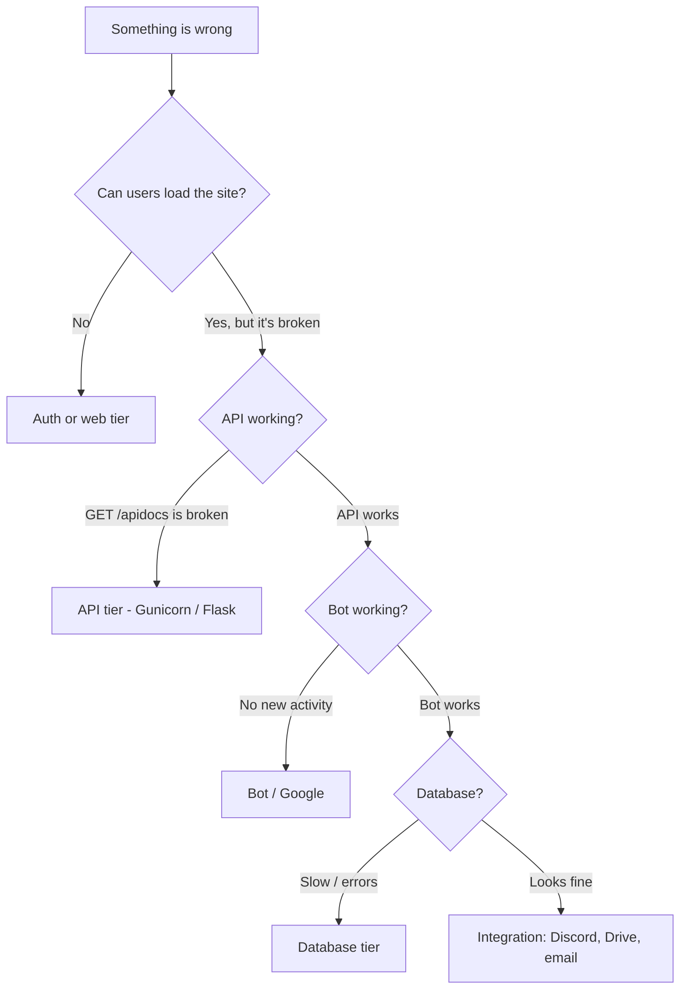

# Troubleshooting

For when something is broken **right now**. Symptoms are indexed first; pick the closest match and follow the diagnosis steps.

For broader background on how the system is wired, see [OPERATIONS.md](OPERATIONS.md).

## How to triage anything



The first question is always: **can I reach the API?** Hit `/apidocs` (or `GET /huntinfo`). If that works, the application is alive — narrow from there.

## Quick reference: where to look

| Symptom area | First place to look |
|---|---|
| Login / SSO broken | OIDC cache (memcache), Apache error log, IdP status |
| Web UI 502 / 504 | Gunicorn process alive? container restart loop? |
| API errors | `/var/log/gunicorn/error.log` or `service=puzzleboss` in Loki |
| Bot not assigning | `service=bigjimmy` in Loki, `bigjimmy_quota_failures` metric |
| Sheets not created | `SKIP_GOOGLE_API`, service account creds, Drive quota |
| Add-on not appearing | Apps Script API enabled? DWD scopes? See [apps-script-deployment.md](apps-script-deployment.md) |
| Discord channels not created | puzzcord daemon up? `SKIP_PUZZCORD`? |
| Signup emails not arriving | `MAILRELAY` reachable? `REGEMAIL` valid? |

---

## Symptoms

### Web UI returns 502 / 503 / 504

The Apache → Gunicorn proxy is broken.

```bash
# Production: check ECS task health in AWS console, look at /metrics and Loki
# Local Docker:
docker-compose ps
docker-compose logs --tail=200 app
docker exec puzzleboss-app supervisorctl status
```

Common causes:

- Gunicorn workers crashed. Look in `/var/log/gunicorn/error.log` for stack traces. Restart: `docker-compose restart app` (local) or redeploy ECS task.
- A worker is stuck. `gunicorn_config.py` defines a worker timeout — but if it's holding the DB lock, you'll see slow responses before timeouts.
- MySQL is unreachable. Check next symptom.

### "Database connection failed" / API 500s with MySQL errors

```bash
# Local:
docker exec puzzleboss-app python -c "
from pblib import refresh_config; refresh_config()"
# Should print no errors

# Production: check RDS status in AWS, security group, network
```

- Verify `MYSQL.HOST` in `puzzleboss.yaml` is reachable.
- If RDS: check the security group allows port 3306 from the ECS task IPs.
- If TLS errors: the `MYSQL.SSL.CA` path needs to point at a valid bundle. For RDS, refresh from <https://truststore.pki.rds.amazonaws.com/global/global-bundle.pem>.
- If Docker locally and you see "TLS/SSL error: No such file or directory": the SSL certs volume is out of sync, `docker-compose down -v && docker-compose up --build`.

### Solvers can't log in (SSO / OIDC)

The OIDC session cache is a hard dependency for `mod_auth_openidc`. If memcache (or Redis post-migration) is down, every login fails with 401 or 400.

```bash
# Production: check the memcache ECS service is running and reachable on port 11211
# from both the puzzleboss container and the mediawiki container

# Apache OIDC errors:
# Loki: {service="puzzleboss"} |= "oidc"
```

- If users are randomly logged out, the cache may be evicting sessions. Check cache memory pressure.
- If only the wiki is broken but Puzzleboss works (or vice versa), the cache backend is up but one container can't reach it. Check networking between containers and the cache service.
- For local Docker dev, OIDC is **not** configured by default — you use `?assumedid=` instead. If you set up OIDC locally and it's broken, that's its own debugging task.

### BigJimmy bot isn't assigning solvers

The bot is running but not detecting activity, or detecting it but not assigning. Cascade through these checks:

1. **Is the bot running?**
   ```bash
   docker exec puzzleboss-app supervisorctl status bigjimmybot
   # Should say RUNNING
   ```
   If `STOPPED` or `FATAL`: look at the log path under supervisord config. In Docker dev, the bot is disabled by default — you have to flip `autostart=true` in `docker/supervisord.conf`.

2. **Is the loop iterating?**
   ```bash
   curl http://localhost:5000/metrics | grep bigjimmy_loop_iterations_total
   ```
   The number should be increasing. If not, the bot is stuck — restart it.

3. **Is `BIGJIMMY_AUTOASSIGN=true` in the config table?** Default is `false`.

4. **Is Google reachable and the service account valid?**
   ```bash
   curl http://localhost:5000/metrics | grep bigjimmy_quota_failures
   ```
   Steadily climbing = you're getting 429s; the bot will back off. A wall of 4xx/5xx in the logs means credentials are bad — check `SERVICE_ACCOUNT_JSON` and `SERVICE_ACCOUNT_SUBJECT` config values.

5. **Are the sheets actually getting activity?** Open the sheet in your browser as a hunt admin and check the hidden `_pb_activity` sheet. If empty, the Apps Script add-on isn't running — see next symptom.

### Apps Script add-on not appearing on new puzzle sheets

The "Puzzle Tools" menu should appear when an admin opens a fresh puzzle sheet.

- **API not enabled:** in GCP, ensure the Apps Script API (`script.googleapis.com`) is enabled.
- **DWD scopes missing:** the service account needs `https://www.googleapis.com/auth/script.projects` in Workspace Admin DWD config. See [apps-script-deployment.md](apps-script-deployment.md#service-account-setup).
- **Activation failed for one specific sheet:** look in API logs for "activate_puzzle_sheet_via_api" errors.
- **Bulk-fix existing puzzles:**
  ```bash
  curl -X POST http://localhost:5000/puzzles/activate_all
  ```
- **`GOOGLE_APPS_SCRIPT_CODE` empty:** the config value must contain the add-on JS source. See [apps-script-deployment.md](apps-script-deployment.md).

### New puzzle creation fails

The endpoint runs 6 sub-steps (DB row → Drive folder check → sheet copy → add-on deploy → activity-sheet init → Discord channel). Any one can fail.

- **Stuck after a partial creation:** check the `temp_puzzle_creation` table — there may be an orphan row.
  ```sql
  SELECT * FROM temp_puzzle_creation;
  DELETE FROM temp_puzzle_creation WHERE code='<code>';
  ```
- **"Drive quota exceeded":** rare but possible if creating hundreds of sheets in a short window. Wait or use a different service-account project.
- **Discord step fails but everything else succeeds:** non-fatal in many setups; the puzzle is created but no channel. Check puzzcord logs.

### Discord channels not being created (or rounds not announced)

- Set `SKIP_PUZZCORD=true` temporarily to isolate whether Discord is the cause of a broader issue.
- `PUZZCORD_HOST` / `PUZZCORD_PORT` reachable from the app container? `nc -zv $PUZZCORD_HOST $PUZZCORD_PORT`.
- puzzcord daemon itself crashed? It's a separate service — restart per its own docs.

### Signup emails not arriving

```bash
# Check that the app can resolve and reach MAILRELAY:
docker exec puzzleboss-app python -c "
import smtplib
s = smtplib.SMTP('YOUR_MAILRELAY_VALUE', 25, timeout=5)
print(s.noop())
s.quit()
"
```

- DNS issue: `MAILRELAY` doesn't resolve. Use an FQDN or IP, or set up `/etc/hosts` / search domains.
- Network blocked: outbound port 25 is blocked from your network. Many cloud providers (AWS, GCP) block this by default — open a support ticket or use a relay that accepts a different port.
- Mail going to spam: check `REGEMAIL` is a real, deliverable `From:` address, and that the relay isn't filtering you.

### `/all` is slow or returning stale data

The cache layer is memcache today, [moving to Redis](../REDIS_MIGRATION.md). `/all` is the hot-path endpoint and caches transparently; `/allcached` is a deprecated alias that hits the same code.

- **Cache miss every time:** check that `MEMCACHE_ENABLED=true` and `MEMCACHE_HOST` / `MEMCACHE_PORT` are correct. If not, the endpoint falls through to a DB query (soft failure — slow but works).
- **Cache hits but stale:** TTL is 15 seconds. Structural changes (status transitions, creation, deletion, round completion) invalidate the cache; solver assignment intentionally does not. See [CLAUDE.md → Caching rules](../CLAUDE.md#caching-rules).

### Web UI loads but data looks wrong

- Hard-refresh the browser — Vue.js components cache aggressively.
- Compare against `GET /all` or `GET /huntinfo` from the API directly. If the API is correct but the UI is wrong, it's a frontend caching issue or a JS error (open browser devtools console).

### Activity feed is empty / not updating

The activity feed shows entries from the `activity` table. Check:

1. `GET /activity` returns recent rows? If yes, it's a frontend issue.
2. `BIGJIMMY_AUTOASSIGN=true`? If `false`, the bot won't write activity rows.
3. Sheet `_pb_activity` populating? See [Apps Script add-on](#apps-script-add-on-not-appearing-on-new-puzzle-sheets).
4. `ACTIVITY_SOURCES` config value matches the database ENUM on `activity.source`? Adding a source to the config without an `ALTER TABLE` will cause inserts to fail silently.

### "Permission denied" / 403 errors in the UI

- The user isn't in the `solver` table — they need to sign up via `ACCT_URI`, or be added manually.
- For admin pages: the user needs a row in `privs` (`puzzleboss` or `puzztech`). See [OPERATIONS.md](OPERATIONS.md#add-an-admin).
- `REMOTE_USER` not being set by Apache — check the OIDC config.

### Random workers throwing tracebacks about integer IDs

If you see `TypeError` involving an ID, or comparison silently failing between `"101"` and `101`:

```bash
curl -X POST http://localhost:5000/migrate/normalize_solver_ids
```

This normalizes legacy string solver IDs in JSON columns to integers. The application code handles both, but the migration eliminates the type mismatch entirely. See [CLAUDE.md](../CLAUDE.md#integer-id-convention) for context.

---

## "Everything seems broken at once" — diagnostic order

When multiple symptoms hit simultaneously, work outside-in:

1. **Network reachability.** Can you reach the public URL at all? If no → DNS, load balancer, or VPC issue (infra repo).
2. **Container / process health.** Are the containers running? ECS task healthy? `docker-compose ps` or AWS ECS console.
3. **Database.** Can the app open a MySQL connection? If RDS is sick, everything else looks sick.
4. **Cache.** OIDC requires the cache. If the cache is sick, logins break — but Puzzleboss itself still works for already-authenticated sessions.
5. **External APIs.** Google or Discord rate-limiting can spike error logs but doesn't take the core app down.

## When to bail and call for help

- You see data loss or corruption in the DB. Stop, snapshot, ask before restoring.
- The hunt is starting in <2 hours and the system is down. Don't try a big migration or schema change — get to a known-good state, even a degraded one (`SKIP_GOOGLE_API=true`, `SKIP_PUZZCORD=true`, OIDC disabled with `ALLOW_USERNAME_OVERRIDE=true` as a desperate fallback) and come back to the integrations.
- You're about to `git reset` or rewrite history because the deploy is broken. Read [CLAUDE.md's git rules](../CLAUDE.md#git-workflow) first — there's almost always a safer way.

## Where to dig deeper

- **Application logs (production):** Loki, label `service=puzzleboss` for web/API, `service=bigjimmy` for bot.
- **Application logs (local):** `docker-compose logs app`, or `/var/log/gunicorn/error.log` inside the container.
- **Apache logs (production):** Loki under `service=puzzleboss`, or `/var/log/apache2/error.log` inside the container.
- **Metrics:** `/metrics` endpoint on the app, scraped to Prometheus, charted in Grafana.
- **Infra-level issues** (ECS, ALB, RDS, security groups, DNS): operations runbook in [puzzleboss2-infra](https://github.com/bigjimmy/puzzleboss2-infra).
